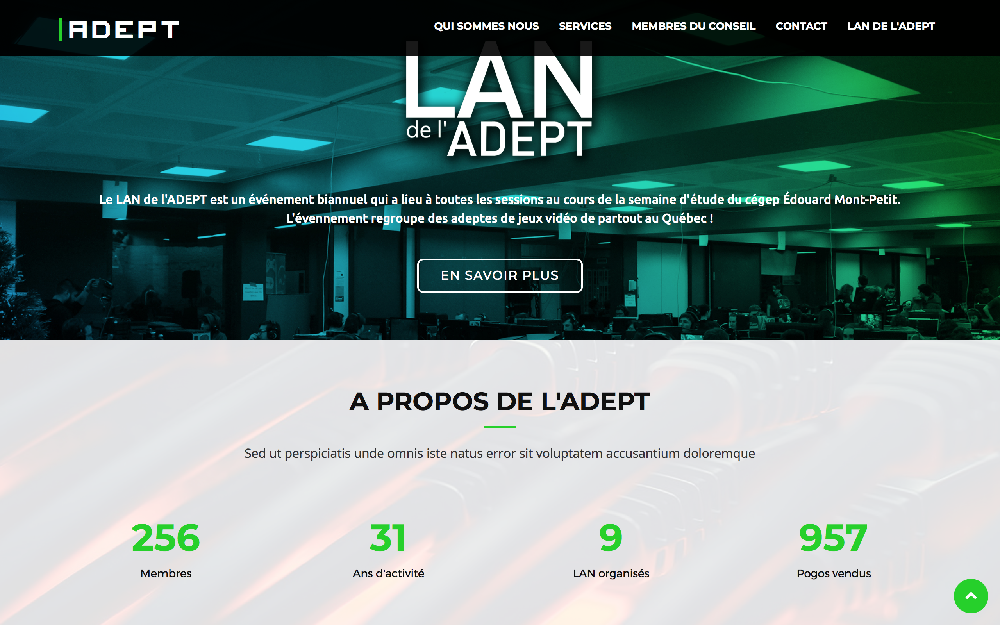
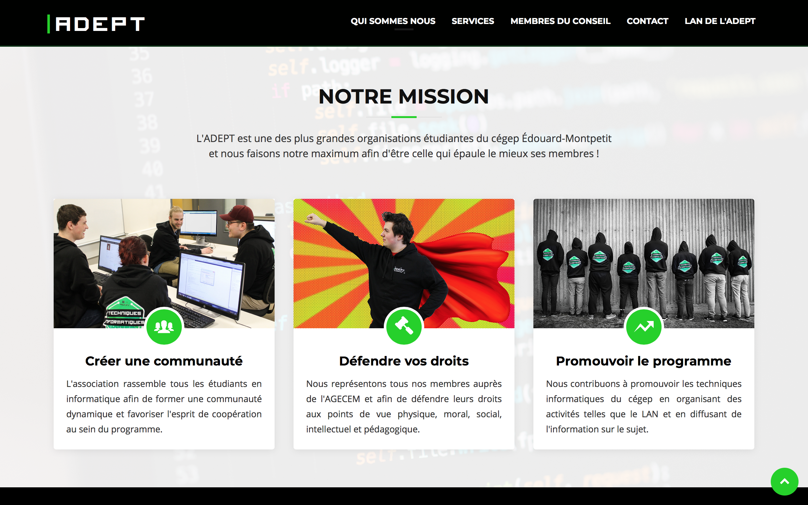

# Site web de l'ADEPT

## Contribution

Votre contribution est la bienvenue! Si vous avez des idées d'éléments à ajouter au site web, nous vous encourageons à créer un [nouvel issue](https://github.com/ADEPT-Informatique/adeptinfo.ca/issues/new) avec le tag **enhancement**.

### Développement local

Prérequis : [Node.js](https://nodejs.org/en/) et un serveur php/mysql local
1. `git clone https://github.com/ADEPT-Informatique/adeptinfo.ca.git`
2. `cd adeptinfo.ca`
3. `npm install`

#### Base de donnée
Certaines fonctionnalités du site nécéssitent l'accès à la base de donnée `adept`. 
Le script de création de la base de donnée du site est disponible dans **`model/adeptbd.sql`**

Le fichier de connexion aà la BD est `model/bdconnect.php`

Avec cette BD il est possible de se connecter à la section admin avec l'utilisateur `admin@adeptinfo.ca` et le mot de passe `Passw0rd`

## Vue d'ensemble

Le nouveau site web de l’ADEPT est un support visuel qui nous permettra d’illustrer la «mission» de l’association, son rôle auprès de ses membres, ainsi que les différents services qu’elle offre. Nous pourrons ainsi informer plus facilement et plus clairement les nouveaux étudiants de l'existence de notre association et encourager plus d’étudiants à s’y joindre.

Nous avons aussi implémentés un module de réservation pour les cotons ouatés de l'ADEPT, accompagné d'un panneau de gestion pour les administrateurs afin de faire le suivi des commandes et des paiements.

## Objectifs principaux

1. **Illustrer la mission de l’ADEPT :** Illustrer clairement le rôle de l’ADEPT en tant qu’association étudiante et envers ses membres.
2. **Expliquer les services offerts :** Présenter les services et activités offerts par l’ADEPT telles que l'autofinancement ou le LAN.
3. **Présenter les membres du CA :** Permettre aux étudiants en informatique de reconnaître les membres du CA de l’association afin de pouvoir les contacter en case de besoin.
4. **Promouvoir l’ADEPT auprès des nouveaux étudiants :** Informer plus facilement les nouveaux étudiants de l’existence de l’ADEPT et les encourager à se joindre.

## Idées de développement ultérieur
- Implémentation d’un forum d’aide entre étudiants pour les cours en informatique
- Implémentation d'une zone de partage de projets peronnels des membres, reliée a github

## Remerciements

Nous aimerions remercier tous les membres de l'ADEPT qui ont collaborés de près ou de loin au développement de ce site web !

- [Matei Martin](https://github.com/handsomeromanian)
- [Christopher St-Pierre](https://github.com/christopherst-pierre)
- [Olivier Brassard](https://github.com/obrassard)
- Philippe Bussière
- [Michael Plourde](https://github.com/MichaelPlourde)
- [Aeden Beaulac](https://github.com/aBeaulac)
- [Mathieu Massicotte](https://github.com/massicottem)
- Nicolas U. Beaumier

De plus, quelques généreux donateurs auront permis au site de rester en ligne, en des temps de sécheresse fiduciaire des fonds alloués à l'associatoin. Les voici :

- [Laurent Bouchard, 10$](https://github.com/LaurentBouchard)
- [Olivier Brassard, 10$](https://github.com/OBrassard)
- [Ricky Chittaphone, 15$]() 
- [William Richer, 20$]()
- [Matthew Duteau, 10$]()
- [Pierre-Olivier Brillant, 5$](https://github.com/PierreOlivierBrillant)

## Screenshots

