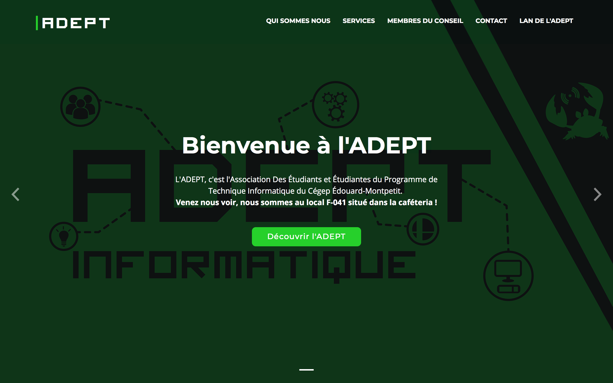

# Site web de l'ADEPT
> Développé par [Christopher St-Pierre](http://github.com/christopherst-pierre) & [Olivier Brassard](http://github.com/obrassard)
## Vue d'ensemble

Le nouveau site web de l’ADEPT est un support visuel qui nous permettra d’illustrer la «mission» de l’association, son rôle auprès de ses membres, ainsi que les différents services qu’elle offre. Nous pourrons ainsi informer plus facilement et plus clairement les nouveaux étudiants de l'existence de notre association et encourager plus d’étudiants à s’y joindre.

Nous avons aussi implémentés un module de réservation pour les cotons ouatés de l'ADEPT, accompagné d'un panneau de gestion pour les administrateurs afin de faire le suivi des commandes et des paiements.

## Objectifs principaux

1. **Illustrer la mission de l’ADEPT :** Illustrer clairement le rôle de l’ADEPT en tant qu’association étudiante et envers ses membres.
2. **Expliquer les services offerts :** Présenter les services et activités offerts par l’ADEPT telles que l'autofinancement ou le LAN.
3. **Présenter les membres du CA :** Permettre aux étudiants en informatique de reconnaître les membres du CA de l’association afin de pouvoir les contacter en case de besoin.
4. **Promouvoir l’ADEPT auprès des nouveaux étudiants :** Informer plus facilement les nouveaux étudiants de l’existence de l’ADEPT et les encourager à se joindre.

## Caractéristiques techniques

- Front-End : Bootstrap V4 + Jquery
- Back-End : PHP 7 (ou 5) + MySQL
- Le site web possédera éventuellement un panneau d'administration afin de faciliter sa gestion et sa mise à jour.

## Idées de développement ultérieur
- Implémentation d’un forum d’aide entre étudiants pour les cours en informatique

## Screenshots

